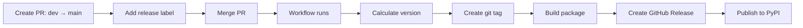

# Release Process

This document describes the complete release process for strapi-kit.

## Overview

strapi-kit uses a **label-based release workflow**:

1. **Production Releases** → PyPI (`release.yml` on a merged PR to `main` that already has `release:major` / `release:minor` / `release:patch`)
2. **Dev Releases** → TestPyPI (`dev-release.yml` on push to `dev`)
3. **Release PR** → `release-pr.yml` opens or updates `release/dev-to-main` when `dev` is pushed

There is no `publish-testpypi.yml`. A PR to `main` does **not** publish a TestPyPI build by itself.

## Current Setup Status

### ✅ What's Working

1. **Automated Workflows**:
   - `release.yml` — production tag + GitHub Release + PyPI
   - `dev-release.yml` — TestPyPI on every push to `dev`
   - `release-pr.yml` — keep a `dev` → `main` PR open

2. **Build Configuration**: `hatchling` + `hatch-vcs` (version from git tags)

3. **Trusted Publishing**: Workflows use OIDC (`id-token: write`)

### ⚠️ What Needs Setup

1. **PyPI Trusted Publishing**: Confirm the publisher on PyPI.org (`release.yml`, environment `pypi` if you set one)
2. **TestPyPI Trusted Publishing**: Confirm the publisher for `dev-release.yml` (environment `testpypi`)

## Version Strategy

Version comes from git tags via `hatch-vcs`. `pyproject.toml` uses
`dynamic = ["version"]`; the hook writes `src/strapi_kit/_version.py`.
`src/strapi_kit/__version__.py` imports that file and falls back to
`0.0.0.dev0+local` for an editable install that has not been built.

```toml
# pyproject.toml (already in the repo)
[build-system]
requires = ["hatchling", "hatch-vcs"]
build-backend = "hatchling.build"

[project]
name = "strapi-kit"
dynamic = ["version"]

[tool.hatch.version]
source = "vcs"

[tool.hatch.build.hooks.vcs]
version-file = "src/strapi_kit/_version.py"
```

Do not put a static `version = "..."` back in `[project]`. The release
workflow tags `main` after a labeled `dev` → `main` merge; that tag is
the published version.

## Release Types

### 1. Production Release (PyPI)

**Trigger**: Merge PR from `dev` → `main` with release label

**Labels**:
- `release:major` - Breaking changes (1.0.0 → 2.0.0)
- `release:minor` - New features (1.0.0 → 1.1.0)
- `release:patch` - Bug fixes (1.0.0 → 1.0.1)

**Process**:



**Steps**:

1. Create PR from `dev` to `main`
2. Add appropriate release label (`release:major`, `release:minor`, or `release:patch`)
3. Merge the PR
4. Workflow automatically:
   - Calculates new version from latest tag + label
   - Creates and pushes git tag
   - Builds wheel and sdist
   - Creates GitHub Release with notes
   - Publishes to PyPI

**Example**:

```bash
# Current version: v0.1.0
# PR with label: release:minor
# → New version: v0.2.0
```

### 2. Test Release (TestPyPI)

There is no separate PR-triggered TestPyPI workflow. Use the **dev
release** below (push to `dev` publishes `{next}.dev{commit_count}`).

To exercise a specific candidate, install that TestPyPI version:

```bash
pip install -i https://test.pypi.org/simple/ \
  --extra-index-url https://pypi.org/simple/ \
  strapi-kit==0.2.0.dev68

python -c "import strapi_kit; print(strapi_kit.__version__)"
```

### 3. Dev Release (TestPyPI)

**Trigger**: Push to `dev` branch

**Process**:

1. Push commits to `dev` branch
2. Workflow automatically:
   - Checks for open PR to main with release labels
   - Calculates version: `{new_version}.dev{commit_count}`
   - Builds and publishes to TestPyPI

**Version Format**: `0.2.0.dev5` (where 5 is commit count since last tag)

## Setting Up Trusted Publishing

### PyPI Setup (Production)

1. Go to https://pypi.org/manage/account/publishing/
2. Add a new publisher:
   - **PyPI Project Name**: `strapi-kit`
   - **Owner**: `mehdizare`
   - **Repository name**: `strapi-kit`
   - **Workflow name**: `release.yml`
   - **Environment name**: (leave blank)

3. Save the configuration

### TestPyPI Setup (Testing)

1. Go to https://test.pypi.org/manage/account/publishing/
2. Add a publisher:
   - **PyPI Project Name**: `strapi-kit`
   - **Owner**: `MehdiZare`
   - **Repository name**: `strapi-kit`
   - **Workflow name**: `dev-release.yml`
   - **Environment name**: `testpypi`

3. Save the configuration

`v0.1.0` is already on PyPI, so a first-upload bootstrap is not needed
for 0.2.0. If Trusted Publishing is missing, add the `release.yml`
publisher (environment `pypi`) before merging the release PR.

## Manual Release Process

### Prerequisites

```bash
# Install build tools
uv pip install build twine
```

### Build Package

```bash
# Clean previous builds
rm -rf dist/ build/ *.egg-info

# Build wheel and source distribution
python -m build

# Verify contents
tar -tzf dist/*.tar.gz
unzip -l dist/*.whl
```

### Test Locally

```bash
# Create test environment
python -m venv test-env
source test-env/bin/activate

# Install from wheel
pip install dist/*.whl

# Test
python -c "import strapi_kit; print(strapi_kit.__version__)"
pytest

# Deactivate
deactivate
rm -rf test-env
```

### Upload to TestPyPI

```bash
# Upload to TestPyPI
twine upload --repository testpypi dist/*

# Test installation
pip install -i https://test.pypi.org/simple/ strapi-kit
```

### Upload to PyPI

```bash
# Upload to PyPI (production)
twine upload dist/*

# Verify
pip install strapi-kit
```

## Hotfix Process

For critical bug fixes that need immediate release:

1. Create hotfix branch from `main`:
   ```bash
   git checkout main
   git pull
   git checkout -b hotfix-critical-bug
   ```

2. Make fixes and test thoroughly

3. Create PR from `hotfix-critical-bug` → `main`

4. Add `release:patch` label

5. Merge PR → automatic release

6. Merge back to `dev`:
   ```bash
   git checkout dev
   git merge main
   git push
   ```

## Version Numbering

Follow [Semantic Versioning](https://semver.org/):

- **MAJOR** (X.0.0): Breaking changes
  - API changes that break backward compatibility
  - Removing features
  - Major refactoring

- **MINOR** (0.X.0): New features
  - New functionality
  - New APIs
  - Deprecations (but not removals)

- **PATCH** (0.0.X): Bug fixes
  - Bug fixes
  - Documentation updates
  - Performance improvements (no API changes)

## Troubleshooting

### Build Fails

```bash
# Check build locally
python -m build

# Common issues:
# - Missing __init__.py files
# - Incorrect package structure
# - Syntax errors
```

### Version Mismatch

If built package has wrong version:

```bash
# Check git tags
git tag -l

# Check latest tag
git describe --tags --abbrev=0

# Check built version
tar -xzOf dist/*.tar.gz "*/PKG-INFO" | grep "^Version:"
```

### Upload Fails

```bash
# Check package on PyPI
# https://pypi.org/project/strapi-kit/

# Check Trusted Publishing setup
# https://pypi.org/manage/account/publishing/

# Verify workflow permissions
# - id-token: write (required for OIDC)
# - contents: write (for creating releases)
```

### TestPyPI Installation Issues

TestPyPI doesn't host all dependencies, so use:

```bash
# Install dependencies from PyPI, package from TestPyPI
pip install -i https://test.pypi.org/simple/ \
  --extra-index-url https://pypi.org/simple/ \
  strapi-kit==VERSION
```

## Changelog Management

Update `CHANGELOG.md` before each release:

```markdown
## [Unreleased]

## [0.2.0] - 2026-08-16

### Added
- New feature X
- New API Y

### Changed
- Improved performance of Z

### Fixed
- Bug in component A
```

Cut `[Unreleased]` into the new version heading (and empty `[Unreleased]`)
in both `CHANGELOG.md` and `docs/changelog.md` **before** opening the
`dev` → `main` PR. Update the compare links at the bottom of
`CHANGELOG.md`.

## Checklist for Releases

Before creating release PR:

- [ ] Unit tests pass (`make test`)
- [ ] Type checking passes (`make type-check`)
- [ ] Linting passes (`make lint`)
- [ ] Coverage ≥ 85% (`make coverage`) — or an explicit waiver if export/import
      paths stay below the target
- [ ] `CHANGELOG.md` and `docs/changelog.md` cut to the new version
- [ ] User-facing docs match shipped behavior (README, MkDocs, `LLM.md`)
- [ ] Upgrade notes listed for behavior changes (stream/export default, etc.)
- [ ] Live e2e (`make e2e`) run against Strapi 5 if D&P or export changed
- [ ] Version bump decided (`release:minor` for 0.2.0)
- [ ] Release PR is labeled **before** merge (`release.yml` reads labels on the merged PR)

## Further Reading

- [PyPI Trusted Publishing Guide](https://docs.pypi.org/trusted-publishers/)
- [Semantic Versioning](https://semver.org/)
- [Python Packaging Guide](https://packaging.python.org/)
- [Hatch Documentation](https://hatch.pypa.io/)
